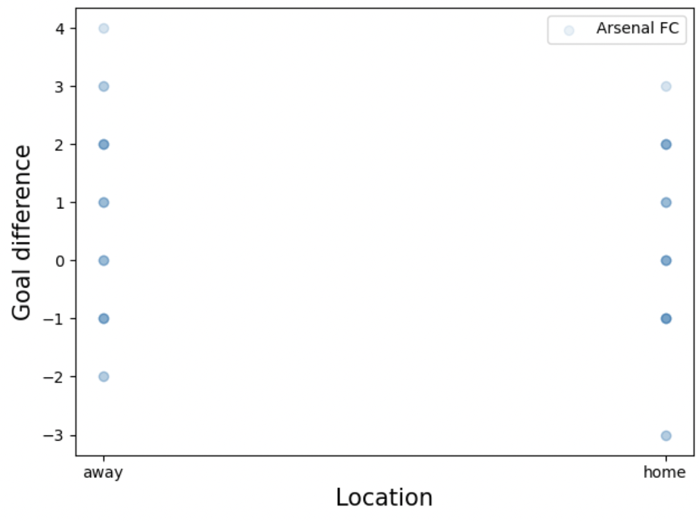

# This is a level-1 header (biggest)

## setup

*  git clone git@github.com:McPeball/kickabout.git
*  conda install -c anaconda flask
*  export FLASK_APP=hello.py
*  export FLASK_ENV=development
* flask run

This is a normal paragraph of text. Blah Blah Blah Blah Blah Blah Blah Blah Blah Blah Blah Blah Blah Blah Blah Blah Blah Blah Blah Blah Blah Blah Blah Blah Blah Blah Blah Blah Blah Blah Blah Blah Blah Blah Blah Blah Blah Blah Blah Blah Blah Blah Blah Blah Blah Blah Blah Blah Blah Blah Blah

* This is 
* A bulleted
* List

## This is a level-2 header (for subsections)


```python
""" This is a block of python code"""
a = dict('bob': 1, 'alice': 2)
```


[Google](https://www.google.com) to find out more about markdown

You can insert images as well


